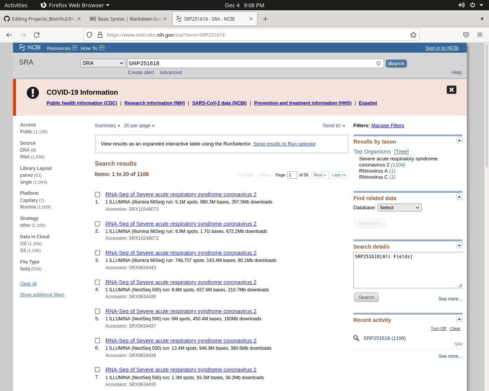

# Proyecto de Bioinformática, ensamble del SARS-CoV-2

Para empezar, vamos a descargar la secuenciacion del SARS-CoV-2, por lo que entramos a la base de datos de NCBI
en la base de datos de SRA con el ID de SRP251618 
